# Auran Clinic — V1 Domain & Database Model

> **Scope:** Backend V1 domain entities and persistence model  
> **Purpose:** Give a developer or reviewer a complete understanding of the data model in roughly 15 minutes.  
> **Architecture:** One backend codebase, multiple clinics, clinic-specific behavior driven by configuration/data.

---

## 1. What this model is solving

Auran Clinic is not being built for one hard-coded customer. The same backend will serve multiple clinics. Each clinic can have different branding, workflow, patient profile fields, measurements, prescription sections, and operational behavior without creating customer-specific code.

V1 therefore needs a stable data model for:

- Users, roles, permissions and protected Super User behavior.
- Patients and fast duplicate detection.
- Dynamic patient medical/profile fields.
- Dynamic clinical measurements.
- Configurable clinic workflow and live queue.
- Visits with multiple doctor sessions in the same visit.
- Delayed clinical documentation.
- Configurable prescriptions / clinical orders.
- Images and files.
- Follow-ups.
- Clinic settings and branding foundation.
- Audit history.

The following are intentionally **not** part of this V1 model: appointments, branches, billing, subscriptions, owner portal, patient mobile application, pharmacy, lab integration, radiology integration, or insurance.

---

## 2. Core conventions

### 2.1 One class per file

Every entity, enum, and EF Core configuration class lives in its own file. This is a deliberate repository convention so files remain easy to navigate, review, and maintain as the product grows.

Example:

```text
Entities/
  Patient.cs
  PatientCondition.cs
  PatientAllergy.cs
  PatientMedication.cs
```

Do not create files such as `PatientEntities.cs` containing several classes.

### 2.2 Entity audit fields

All entities inherit the common audit properties from `BaseEntity`:

```csharp
public abstract class BaseEntity
{
    public Guid Id { get; set; }
    public DateTime CreatedDate { get; set; }
    public DateTime? UpdatedDate { get; set; }
    public Guid? CreateByUserId { get; set; }
    public Guid? UpdatedByUserId { get; set; }
}
```

Although the names do not contain `Utc`, backend persistence must treat `CreatedDate` and `UpdatedDate` as UTC timestamps.

`CreateByUserId` and `UpdatedByUserId` are nullable because some records can be produced by system initialization/seeding before an application user exists.

### 2.3 Clinic ownership

Clinic-owned business entities inherit:

```csharp
public abstract class ClinicEntity : BaseEntity
{
    public Guid ClinicId { get; set; }
}
```

This creates a consistent isolation boundary for clinic business data. No implementation should introduce checks such as `if clinic == EyeClinic`; differences belong in configuration records.

### 2.4 Enum storage

C# enums are used only for states/types controlled by the application code. **Enums are persisted as strings**, not numeric ordinals.

Example C#:

```csharp
public enum DocumentationStatus
{
    NotStarted,
    Draft,
    Pending,
    Completed
}
```

Database value:

```text
Draft
```

not:

```text
1
```

EF Core configurations explicitly use:

```csharp
builder.Property(x => x.Status)
    .HasConversion<string>();
```

This makes database records readable and prevents accidental meaning changes if enum ordering changes later.

### 2.5 Configurable values are not enums

Values the clinic can create or change must be stored as data.

For example, workflow statuses are records:

```text
Waiting
With Doctor
Drops
Ready For Recheck
Exited
```

They are **not** a C# enum because every clinic can configure a different workflow.

---

## 3. Full V1 model overview

```mermaid
flowchart TB
    Clinic[Clinic]
    Settings[ClinicSettings]

    User[User]
    Role[Role]
    Permission[Permission]
    UserRole[UserRole]
    RolePermission[RolePermission]

    Patient[Patient]
    Condition[PatientCondition]
    Allergy[PatientAllergy]
    Medication[PatientMedication]

    ProfileSection[PatientProfileSection]
    ProfileField[PatientProfileField]
    ProfileOption[PatientProfileFieldOption]
    ProfileValue[PatientProfileValue]

    ClinicalField[ClinicalField]
    ClinicalOption[ClinicalFieldOption]
    Measurement[ClinicalMeasurement]

    WorkflowStatus[WorkflowStatus]
    WorkflowTransition[WorkflowTransition]
    QueueEntry[QueueEntry]
    QueueHistory[QueueStatusHistory]

    Visit[Visit]
    Session[VisitSession]

    OrderDefinition[ClinicalOrderSectionDefinition]
    Order[ClinicalOrder]
    OrderSection[ClinicalOrderSection]
    OrderItem[ClinicalOrderItem]

    File[FileRecord]
    PatientAttachment[PatientAttachment]
    OrderAttachment[ClinicalOrderAttachment]

    FollowUp[FollowUp]
    Audit[AuditLog]

    Clinic --> Settings
    Clinic --> User
    Clinic --> Patient
    Clinic --> ProfileSection
    Clinic --> ClinicalField
    Clinic --> WorkflowStatus
    Clinic --> Visit
    Clinic --> Audit

    User --> UserRole
    Role --> UserRole
    Role --> RolePermission
    Permission --> RolePermission

    Patient --> Condition
    Patient --> Allergy
    Patient --> Medication
    Patient --> ProfileValue
    Patient --> Measurement
    Patient --> Visit
    Patient --> FollowUp
    Patient --> PatientAttachment

    ProfileSection --> ProfileField
    ProfileField --> ProfileOption
    ProfileField --> ProfileValue

    ClinicalField --> ClinicalOption
    ClinicalField --> Measurement

    WorkflowStatus --> WorkflowTransition
    Visit --> QueueEntry
    QueueEntry --> QueueHistory
    Visit --> Session

    Visit --> Order
    OrderDefinition --> OrderSection
    Order --> OrderSection
    OrderSection --> OrderItem
    Order --> OrderAttachment

    File --> PatientAttachment
    File --> OrderAttachment
```



---

## 4. Identity and authorization

### User

Represents an application user inside a clinic.

Key properties:

```text
ClinicId
IdentityUserId
FullName
Email
Phone
IsSuperUser
```

Authentication credentials belong to ASP.NET Core Identity. The domain `User` stores clinic/business information.

`IsSuperUser` is a user-level protected flag rather than a normal role. A Super User receives complete access inside their clinic and cannot have that access reduced by ordinary RBAC operations.

### Role

System role definition.

```text
Code
Name
IsSystem
```

V1 system roles are seeded and protected. They cannot be renamed or deleted through normal application operations.

### Permission

Stable system permission definition.

Examples:

```text
Patient.View
Patient.Create
Queue.Move
Visit.Edit
Reports.View
Settings.Manage
```

### UserRole

Many-to-many relationship between users and roles.

A user may have multiple roles.

Effective permissions are the union of permissions granted by all assigned roles.

### RolePermission

Many-to-many relationship between roles and system permissions.

---

## 5. Patient model

### Patient

Contains only universal patient identity/basic information:

```text
ClinicId
PatientNumber
FullName
Phone
Gender
DateOfBirth
Notes
```

Specialty-specific fields such as IOP, blood pressure, blood sugar, visual acuity, etc. do **not** belong directly on the Patient table.

Important database constraints:

```text
UNIQUE (ClinicId, PatientNumber)
UNIQUE (ClinicId, Phone)
```

This means two different clinics may independently have the same phone or patient number, while duplicates inside one clinic are prevented.

### PatientCondition

Historical/current medical condition recorded for the patient.

### PatientAllergy

Patient allergy, optional reaction and notes.

### PatientMedication

Current medication recorded as part of the patient's medical profile. This is separate from a prescription issued during a visit.

---

## 6. Dynamic patient profile

Different clinics require different patient information, so profile configuration is data driven.

### PatientProfileSection

Defines a profile section such as:

```text
General Medical Information
Ophthalmology
Dental History
Lifestyle
```

Supports ordering, enabling/disabling and system-defined sections.

### PatientProfileField

Defines one configurable field inside a section.

Supported `DynamicFieldType` values:

```text
Text
LongText
Number
Boolean
Date
Image
File
SingleSelect
MultiSelect
```

`DynamicFieldType` is persisted as a string.

### PatientProfileFieldOption

Stores available choices for SingleSelect or MultiSelect fields.

### PatientProfileValue

Stores the patient's actual value for one configured field.

Typed columns are used:

```text
TextValue
NumberValue
BooleanValue
DateValue
FileId
JsonValue
```

This is preferred over one unstructured JSON document because validation, filtering, reporting and future migration remain easier.

---

## 7. Clinical fields and measurements

### ClinicalField

Defines a configurable clinical measurement.

Examples:

```text
Blood Pressure
Blood Sugar
Weight
IOP Right
IOP Left
Visual Acuity
```

Contains:

```text
Name
FieldType
Unit
IsEnabled
SortOrder
```

`FieldType` is persisted as a string.

### ClinicalFieldOption

Options for selectable clinical fields.

### ClinicalMeasurement

Stores a historical recorded value for a patient and optionally a visit.

Measurements are append/history records. Recording a new measurement must not overwrite the old measurement.

---

## 8. Workflow and live queue

The clinic has one configurable operational workflow in V1.

### WorkflowStatus

A clinic-created status:

```text
Code
Name
Color
SortOrder
IsSystemFinal
```

`Color` accepts a normal color value such as a hex value. It is not restricted to a predefined color enum.

### WorkflowTransition

Defines an allowed move:

```text
FromStatusId -> ToStatusId
```

Database uniqueness:

```text
UNIQUE (ClinicId, FromStatusId, ToStatusId)
```

### QueueEntry

Represents the current operational queue state for one visit.

Important fields:

```text
PatientId
VisitId
DoctorId
WorkflowStatusId
EntryAtUtc
ExitAtUtc
RowVersion
```

`RowVersion` is configured as SQL Server row-version concurrency data so two employees cannot silently overwrite the same queue movement.

### QueueStatusHistory

Stores every transition rather than only the current state.

This enables later reports such as:

```text
Waiting duration
Time with doctor
Time in observation/drops
Total patient cycle time
```

---

## 9. Visits and multiple sessions

### Visit

Represents one complete patient encounter.

Important fields:

```text
PatientId
DoctorId
Status
DocumentationStatus
EntryAtUtc
CompletedAtUtc
ExitAtUtc
ChiefComplaint
Examination
Diagnosis
Notes
TreatmentPlan
FollowUpText
```

`VisitStatus` and `DocumentationStatus` are deliberately separate.

Example:

```text
Visit Status = Completed
Documentation Status = Pending
```

This supports doctors who finish seeing the patient but enter the detailed medical documentation later.

Both enums are stored as strings.

### VisitSession

A visit may contain multiple doctor sessions.

Example eye-clinic flow:

```text
10:00 doctor session #1
10:10 patient leaves doctor room for drops
10:15 another patient enters
10:40 original patient returns
10:42 doctor session #2
```

This is still one Visit, with two VisitSession records.

---

## 10. Prescription / clinical orders

A prescription is modeled as configurable clinical-order sections rather than assuming every prescription contains only medication.

### ClinicalOrderSectionDefinition

Clinic configuration for available sections.

`ClinicalOrderSectionType` values:

```text
Structured
Text
Image
File
```

Stored as strings in SQL Server.

Typical section definitions:

```text
Medications
Lab Investigations
Radiology
Procedures
Instructions
Prescription Image
```

### ClinicalOrder

One order/prescription generated from a visit.

### ClinicalOrderSection

One configured section inside an order.

### ClinicalOrderItem

Structured entry inside a section, with `DetailsJson` reserved for section-specific structured details without creating a new table for every prescription format.

---

## 11. Files and attachments

### FileRecord

Stores metadata only:

```text
OriginalName
StoredName
ContentType
Size
StorageProvider
StorageKey
UploadedAtUtc
UploadedByUserId
```

Actual large binary content should live in object/file storage rather than SQL Server.

### PatientAttachment

Links a file to a patient.

### ClinicalOrderAttachment

Links files/images to an order or specific order section.

This supports scanned prescriptions, lab result images, radiology images and other clinical documents.

---

## 12. Follow-ups

### FollowUp

V1 follow-up is a clinical recommendation, not appointment scheduling.

Fields include:

```text
PatientId
VisitId
DoctorId
Recommendation
RecommendedAfterDays
RecommendedDate
Status
```

`FollowUpStatus` is stored as a string.

Appointments and calendar slots remain future scope.

---

## 13. Clinic settings

### ClinicSettings

Holds clinic operational settings such as:

```text
Phone
Email
Address
Website
Locale
DateFormat
TimeFormat
DocumentationReminderHours
PrescriptionHeader
PrescriptionFooter
WelcomeButtonText
```

The existing `Clinic` entity holds core clinic/branding information including name, code, colors, font, logo, welcome content, timezone and patient number prefix.

This is enough to provide a single frontend/backend that displays clinic-specific branding without creating a different application per customer.

---

## 14. Audit

### AuditLog

Records important application actions:

```text
ActorUserId
Action
EntityType
EntityId
OccurredAtUtc
MetadataJson
IpAddress
```

Examples:

```text
Patient.Created
Patient.Updated
Queue.StatusChanged
Visit.DocumentationUpdated
User.RolesChanged
Workflow.Updated
Settings.Updated
```

Audit metadata must never contain passwords, JWT tokens, secrets or unnecessary sensitive payloads.

---

## 15. Database constraints and persistence rules

Important constraints currently represented in EF Core configuration:

| Rule | Database behavior |
|---|---|
| Patient number unique inside clinic | Unique `(ClinicId, PatientNumber)` |
| Patient phone unique inside clinic | Unique `(ClinicId, Phone)` |
| Role code | Unique |
| Permission code | Unique |
| User-role assignment | Unique `(ClinicId, UserId, RoleId)` |
| Role-permission assignment | Unique `(RoleId, PermissionId)` |
| Workflow status code | Unique per clinic |
| Workflow transition | Unique per clinic/from/to |
| Clinic settings | One record per clinic |
| Queue concurrency | SQL Server rowversion |
| Enums | Stored as strings |

---

## 16. Enum persistence mapping

EF Core mappings explicitly convert every current enum property to string:

```text
PatientProfileField.FieldType
ClinicalField.FieldType
Visit.Status
Visit.DocumentationStatus
ClinicalOrderSectionDefinition.SectionType
FollowUp.Status
```

Example:

```csharp
builder.Property(x => x.DocumentationStatus)
    .HasConversion<string>()
    .HasMaxLength(32);
```

This convention must be followed whenever a new persisted enum is introduced.

---

## 17. V1 boundary

This entity model is complete for the current backend foundation but deliberately avoids designing future modules prematurely.

### Included now

```text
Clinic foundation
Users / RBAC
Patients
Medical profile
Dynamic fields
Clinical measurements
Workflow
Queue
Visits
Multi-session visits
Delayed documentation
Clinical orders / prescriptions
Files
Follow-ups
Settings
Audit
```

### Deferred

```text
Branches
Appointments
Patient mobile application
Plans
Subscriptions
Billing
Owner portal
Auran platform administration
Insurance
Pharmacy
External lab/radiology integrations
Advanced financial modules
```

When these modules are introduced later they should extend the current model rather than require clinic-specific forks.

---

## 18. Developer checklist for new entities

Before adding a new entity, verify:

- Does this information really belong in V1?
- Is it global or clinic-owned?
- If clinic-owned, does it inherit `ClinicEntity`?
- Is the class in its own file?
- Are audit fields inherited from `BaseEntity` rather than duplicated?
- If an enum is persisted, is it explicitly converted to string?
- Is the value actually configurable and therefore better modeled as data rather than an enum?
- Are required unique/index/concurrency rules configured?
- Does the design avoid customer-specific code?
- Does the entity avoid duplicating data already owned by another aggregate?

This document is the source of truth for the V1 entity design until the domain model is intentionally revised in a later ticket.
