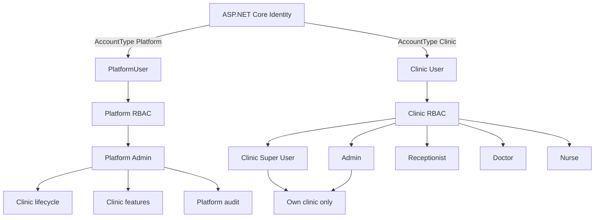
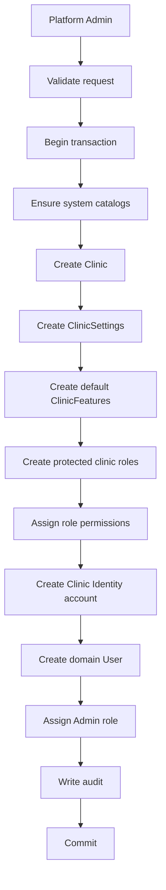

# Platform, Clinic Provisioning, Features & Audit

## Security scopes

AURAN Clinic separates platform administration from clinic operation. The scopes share ASP.NET Core Identity as a credential store but use different domain users, RBAC graphs, JWT claims and authorization policies.



The platform scope manages tenants; it does not implicitly enter their clinical scope. A future support-access feature must be explicit, time-bound and audited.

## Platform bootstrap

The first Platform Admin creates a bootstrap problem because no Platform Admin exists yet to create one. The backend therefore supports an idempotent deployment-time bootstrap.

Bootstrap is disabled by default. When enabled and no `PlatformUser` exists, deployment configuration must provide the initial name, email and password. The service ensures system permission and feature catalogs, creates the protected `PLATFORM_ADMIN` role, maps all platform permissions, creates the Identity account with `AccountType=Platform`, creates the `PlatformUser`, assigns the role and writes a platform audit event.

There is no public platform registration endpoint. Production values must come from secret/environment configuration.

## Clinic provisioning

Only an authenticated platform actor with `Platform.Clinics.Create` can provision a clinic.



A provisioning failure rolls back the workflow so partially initialized clinics are not left behind.

## Protected roles

Every clinic starts with Admin, Receptionist, Doctor and Nurse. Their codes are system-defined and clinic-scoped. The same role code can exist in different clinics because uniqueness is `(ClinicId, Code)`.

Clinic Super User is a property of a clinic user, not a platform privilege. It bypasses clinic permission checks only after the request has been validated as an active clinic actor.

## Features

`FeatureDefinition` is a global catalog. `ClinicFeature` maps a feature to a clinic with enabled state and optional configuration.

Initial catalog:

- Patients
- Dynamic Patient Profile
- Queue
- Visits
- Clinical Orders
- Follow-ups
- Reports
- Advanced Reports
- AI Features

Feature entitlement is independent from RBAC permission. The authorization sequence for a feature-backed clinic endpoint is:

```text
valid clinic token -> active clinic -> enabled feature -> required clinic permission -> endpoint
```

The centralized clinic access service uses `IDistributedCache`. Platform changes invalidate the affected status/feature cache entry so changes take effect without waiting for JWT expiration.

## Clinic suspension

Clinic login and refresh reject inactive clinics. Authorization also checks clinic active state for protected requests, which prevents an already-issued JWT from remaining usable after suspension.

## Audit model

Audit records can be platform or clinic scoped:

```text
AuditLog
  Scope: Platform | Clinic
  ClinicId: nullable
  ActorType: Platform | Clinic | System
  ActorId: nullable
  ActorIdentityUserId
  ActorDisplayName
  ActorEmail
  Action
  Category
  EntityType / EntityId
  Description
  MetadataJson
  IpAddress / UserAgent / CorrelationId
  OccurredAtUtc
```

Actor display information is stored as a snapshot so historical records stay understandable if a user is later renamed or removed.

Automatic EF Core auditing captures entity create/update/delete changes. Explicit audit events cover authentication, token rotation, authorization denials, provisioning, clinic lifecycle and feature changes.

Audit data is append-only through the API. No update/delete audit endpoints are exposed.

## Audit visibility

A clinic actor can read only `Scope=Clinic` records belonging to its authenticated `ClinicId`.

A platform actor can read platform-scope records and clinic-management records performed by platform actors. Platform audit does not automatically reveal clinic-user clinical activity.

A platform action against a clinic, for example suspending a clinic or disabling Reports, is stored with `Scope=Clinic`, the target `ClinicId`, and `ActorType=Platform`. This makes the administrative action visible in the clinic history while preserving actor origin.

## Secret handling

Audit redaction must cover passwords, password hashes, JWT/access tokens, refresh tokens, signing keys, API keys, credentials, connection strings and secrets. Production JWT signing keys and Platform Bootstrap credentials are never committed to source control.

## API boundaries

Platform endpoints use `/api/platform/...`; clinic self-service uses `/api/clinic/...`; existing clinic authentication remains `/api/auth/...`.

Important operation IDs include:

```text
PlatformAuth_Login
PlatformAuth_RefreshToken
PlatformAuth_Logout
PlatformClinics_Search
PlatformClinics_GetById
PlatformClinics_Create
PlatformClinics_Update
PlatformClinics_SetStatus
PlatformClinicFeatures_Get
PlatformClinicFeatures_Update
PlatformAuditLogs_Search
Clinic_GetCurrent
ClinicSettings_Get
ClinicSettings_Update
ClinicFeatures_GetCurrent
AuditLogs_Search
```

These operation IDs are stable machine-readable identifiers for future AI tool discovery.
